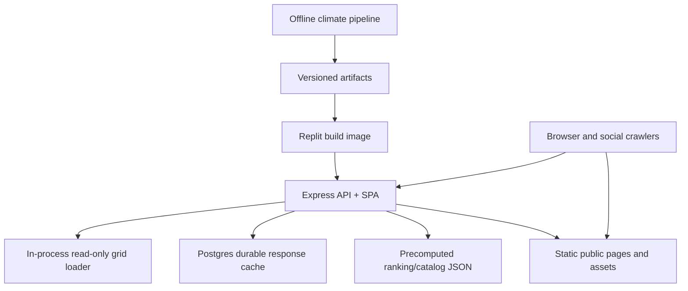

# Technical Design - consumer-grade fupit on Replit

**Status:** draft technical design, 2026-06-27.
**Scope:** public fupit climate web app on Replit Autoscale, serving grounded climate and habitability projections for any location to 2100.
**Product requirements:** `docs/PRODUCT_REQUIREMENTS.md`.
**Science authority:** `docs/architecture/SCIENTIFIC_GROUNDING.md`.

## Executive Decision

Ship fupit as a stateless read-mostly service:

1. Precompute heavy climate science offline.
2. Package immutable, versioned climate artifacts with the app image.
3. Serve cached annual trajectories and rankings through Replit Autoscale.
4. Use Postgres for durable response cache, lightweight user-created records, and future audit metadata.
5. Keep request-time work to validation, lookup, interpolation, transparent scoring, and JSON assembly.

The current default serving path uses the Node.js in-process grid reader. The Python
subprocess remains only as an explicit fallback and parity oracle while live Replit proof is
collected.

## Constraints

### Hosting

Replit Autoscale is a good fit for a public educational launch because it gives HTTPS, simple deploys, automatic scaling, and scale-to-zero economics. It also imposes design constraints:

- Machines are disposable. Do not depend on local writes, worker-local cache, or manually edited files after deployment.
- Autoscale can run more than one machine. In-memory cache is a per-machine optimization, not shared truth.
- Cold starts matter. Startup must not run climate ingestion, large NetCDF reads, npm install, schema migration, or cache rebuilds.
- Republish/deploy state is external operational truth. A green Git push does not prove the public site is live.
- Request duration and memory/CPU usage drive cost and reliability. Long Python subprocesses are
  fallback-only, not the normal hot path.

The current Replit deployment uses Node.js, Python, Postgres, Autoscale, `npm run build`, and `npm run start`.

Reference: Replit Autoscale Deployments documentation: https://docs.replit.com/references/publishing/autoscale-deployments

### Product

- Every shown number needs a source and method.
- Any-location search is the primary product; fixed catalogs are only for climate twins, rankings, examples, and tests.
- Trend graphs and annual trajectories are core.
- Scenario default is a versioned current-policy reference, with Paris-compatible and high-end stress-test pathways available.
- Enrichment layers need source/license registry rows before display or API export.
- Public docs must stay educational/research-focused and avoid unrelated project or personal goals.

### Current State

- `server/grounded-node-model.ts` reads the compact grid and observed baseline artifacts through
  the TypeScript grid reader.
- `grounded_model.py` reads the same artifacts only as the `CLIMATE_GRID_ENGINE=python`
  fallback/parity oracle.
- Compact artifacts are small enough for Replit image startup:
  - `data/grid.i16.gz`: about 35 MB.
  - `data/worldclim10m.i16.gz`: about 16 MB.
  - `data/manifest.json`: about 56 KB.
  - `data/ranking_cities.json`: about 4 KB.
- `/api/climate-trajectory` uses the Node grid engine by default for uncached years and caches
  each point in `climate_model_cache`.
- `climate_model_cache` is version-wrapped, but its unique index is currently `(lat_key, lng_key, year)`. Target design must include scenario and model/cache version in cache identity.
- Memory currently records public Replit verification as unresolved/stale. Treat production deploy state as unknown until `/api/health` and live endpoint smoke pass after republish.

## Performance Targets

These targets are for consumer-grade public service, not scientific batch jobs.

| Surface | Launch target | Scale target | Notes |
|---|---:|---:|---|
| Static document TTFB | p95 < 300 ms warm | p95 < 150 ms with CDN | Home, comparison, methodology, `llms.txt`, sitemap. |
| JS/CSS asset caching | immutable hashed assets | immutable hashed assets | Replit origin can serve; CDN optional for viral spikes. |
| Health endpoint | p95 < 100 ms | p95 < 50 ms | No DB required. |
| Cached trajectory API | p95 < 300 ms | p95 < 150 ms | 17 annual/checkpoint points, from Postgres or in-process LRU. |
| Uncached trajectory API | p95 < 500 ms warm Node target | p95 < 500 ms target | Python is fallback-only; Node warm p95 is guarded locally. |
| Rankings API | p95 < 300 ms | p95 < 150 ms | Must be precomputed. No live global sorting. |
| Source registry API/page | p95 < 200 ms | p95 < 100 ms | Static JSON or in-memory manifest. |
| Error rate | < 1% user-visible 5xx | < 0.1% user-visible 5xx | Exclude client validation 4xx. |
| Cold start | < 5 s | < 3 s | No data ingestion or DB migrations at boot. |
| Availability goal | best-effort public launch | 99.5% practical target | Replit-native, no custom operations burden. |

Rate targets for launch:

- 100 concurrent users browsing static pages.
- 20 concurrent active forecast users on warm cache.
- 5 uncached trajectory fills per second for short bursts without saturating CPU.
- Viral-readiness path: 1,000+ concurrent readers if static assets and share pages are cached at CDN/front-door layer and API cache hit rate is high.

The hard rule: public virality must hit cached/static paths. A viral post must not create a Python-subprocess storm.

## Target Architecture



### Offline Pipeline

Runs outside Replit on Spark/DGX/local workstation/cloud batch:

- Fetch and reduce CMIP6/IPCC/AR6/source datasets.
- Build compact binary artifacts for the serving grid.
- Build annual trajectory layers or interpolation anchors.
- Build population/city/country ranking catalogs.
- Build source/license registry.
- Run anchor validation and audit city regression checks.
- Emit one immutable release bundle:
  - `data/grid.<methodVersion>.i16.gz`
  - `data/worldclim.<methodVersion>.i16.gz`
  - `data/rankings.<methodVersion>.json.gz`
  - `data/catalogs.<methodVersion>.json`
  - `data/source-registry.<methodVersion>.json`
  - `data/manifest.json`

Artifact manifest must include `methodVersion`, `cacheVersion`, `artifactHash`, supported scenarios, default scenario policy version, source registry version, generated timestamp, validation summary, and required app schema version.

### Replit Runtime

Runtime stays boring:

- Express 5 serves the built React app, SEO HTML, health, source registry, forecasts, rankings, and share pages.
- On machine boot, Node loads artifact manifests and decodes compact arrays.
- No ingestion, NetCDF, Copernicus, NASA downloads, cBottle, or GPU calls in the request path.
- Postgres is optional for read-only artifact lookup but required for durable response cache and user-created location/comparison records.

### API Shape

Launch public APIs:

- `GET /api/health`: no DB dependency; returns deployment commit, artifact hashes, cache version, source-registry version, and supported scenarios.
- `POST /api/climate-trajectory`: input `{ coordinates, years, scenario }`; output annual points, metadata, uncertainty, source receipt, cache status.
- `GET /api/climate/global-rankings`: input `metric`, `year`, `scenario`, `catalog`, `limit`; output precomputed ranked rows with catalog/source/uncertainty/exclusion metadata.
- `GET /api/source-registry`: returns source rows used by current artifact bundle.
- `GET /api/climate-twin`: input coordinates, year, scenario, catalog; output bounded current-day analog result, alternatives, distance components, deltas, source receipt, catalog caveats, and a data-derived "no close catalog analog" flag.
- `GET /api/build-info`: optional lightweight debug endpoint with no protected values.

Endpoints that cannot be grounded must return 404/410/422, not fabricated fallback data.

## Cache Architecture

Use five layers, ordered by cheapest hit:

1. Browser/TanStack Query cache keyed by location, rounded coordinates, year range, scenario, and method version.
2. HTTP cache for static assets, source registry, rankings, and share pages.
3. Per-machine in-process LRU for common forecast responses.
4. Postgres durable response cache for rounded coordinate/year/scenario/modelVersion.
5. Immutable binary artifacts as source of truth.

### Required Cache Keys

Every persisted forecast cache row must include:

- rounded latitude key
- rounded longitude key
- year
- scenario
- model/cache version
- source-registry version

Current schema stores scenario inside JSON and keys only by `(latKey, lngKey, year)`. That is safe only if the code rejects mismatched payloads before reuse; it is inefficient and fragile under scenario switching. Target schema should add a real `scenario` column and unique index:

```sql
unique(lat_key, lng_key, year, scenario, cache_version)
```

For annual trajectories, either store one row per point or store a compact trajectory row:

```sql
unique(lat_key, lng_key, start_year, end_year, cadence, scenario, cache_version)
```

Prefer one row per year for compatibility now; add trajectory rows only after measuring DB round trips.

### Cache Invalidation

- New scientific method or artifact bundle means new `MODEL_CACHE_VERSION`.
- Startup purge may delete incompatible cache rows, but launch should prefer fail-closed read guards over destructive startup work.
- Production cache purge remains required after any fabricated-output era unless a version guard has been proven live on public `/api/health`.

## Serving Grid Options

### Option A - Fallback Bridge: Python Subprocess

Pros:

- Already works.
- Lowest implementation risk.
- Keeps exact output contract.

Cons:

- Loads grid per subprocess unless Python process is kept warm.
- Bounded concurrency of 2 is not consumer-scale.
- 60-second timeout protects the server but creates user-visible failures under bursts.
- Rankings can spawn Python and should not do live catalog computation under load.

Use only for explicit fallback (`CLIMATE_GRID_ENGINE=python`) and smoke/parity verification.

### Option B - Node.js In-Process Grid Reader

Pros:

- Best fit for Replit Autoscale.
- Loads compact grid once per machine.
- Avoids subprocess overhead and Python dependency in hot path.
- Enables fast cached/uncached trajectory assembly.

Cons:

- Requires porting artifact decoder and interpolation logic from `grounded_model.py`.
- Must prove byte-level/contract parity with Python for a fixed city matrix.

This is the target architecture for consumer scale.

Implementation sequence:

1. Write `server/climate-grid-loader.ts` to read `manifest.json`, `grid.i16.gz`, and `worldclim10m.i16.gz`.
2. Write pure functions for coordinate sampling, temporal interpolation, scenario selection, and risk-score assembly.
3. Add contract tests comparing Node output to `grounded_model.py` for Helsinki, London, Singapore, Mumbai, Cairo, Manaus, Amsterdam, Bangkok, New York, and San Francisco.
4. Switch trajectory generation to Node grid service as the default; keep
   `CLIMATE_GRID_ENGINE=python` as the rollback path for one release.
5. Remove Python fallback after live parity, cache, and Replit performance proof pass.

### Option C - Postgres Grid Table

Pros:

- Simple query model.
- Works across all Replit machines.
- Easy to inspect.

Cons:

- More DB rows and query round trips.
- DB becomes the hot path for every uncached request.
- Harder to beat in-memory artifact lookup latency.

Use Postgres for response cache and metadata; do not make it the primary grid engine unless the binary artifact path becomes operationally painful.

## Data and Source Registry

Add a source registry artifact before adding enrichment modules:

```json
{
  "sourceId": "wri-aqueduct-4",
  "provider": "World Resources Institute",
  "version": "4.x",
  "stableUrl": "https://www.wri.org/aqueduct",
  "license": "...",
  "commercialReuse": "allowed|restricted|unknown",
  "redistribution": "allowed|restricted|unknown",
  "variables": ["baseline water stress"],
  "spatialResolution": "...",
  "temporalResolution": "...",
  "scenarioCoverage": "...",
  "method": "...",
  "displayPolicy": "show|suppress|caveat",
  "reviewedAt": "YYYY-MM-DD"
}
```

No source registry row means no public metric, no API field, and no ranking dimension.

## Rankings Architecture

Rankings must be precomputed, not generated by calling the model for every catalog location at request time.

### Catalogs

- `curated_cities`: hand-curated examples for communication and smoke tests.
- `natural_earth_populated_places_110m`: Natural Earth 1:110m populated-place point catalog
  filtered to `pop_max >= 3,000,000`; useful as a bounded population-place ranking catalog,
  not a GHSL urban-center or population-weighted exposure product.
- `urban_centers`: future GHSL-style urban centers with population threshold and version.
- `countries`: country or population-weighted national summaries.
- `population_weighted_regions`: optional v1.1/v1.2 layer.

### Ranking Artifact

Build offline:

```json
{
  "methodVersion": "grounded-grid-i16-v3",
  "catalog": "urban_centers",
  "scenario": "ssp245",
  "year": 2050,
  "metric": "heat_stress_days",
  "direction": "highest",
  "rows": [
    {
      "rank": 1,
      "id": "...",
      "name": "...",
      "country": "...",
      "lat": 0,
      "lng": 0,
      "value": 0,
      "unit": "days/year",
      "uncertainty": {"low": 0, "high": 0},
      "sourceReceipt": ["cmip6-etccdi", "worldclim-v2.1"]
    }
  ],
  "catalogSize": 0,
  "exclusions": []
}
```

API should slice precomputed rows and expose source/caveat text. Do not sort the world live inside Replit.

## Frontend Architecture

The first screen should remain the usable climate search/result experience, not a marketing landing page.

- One routed app with any-location search, trend-first result view, scenario controls, climate twin, source receipt, and share actions.
- Comparison route reuses the same trajectory API and does not duplicate model logic.
- Rankings route loads precomputed ranking API and shares the tooltip/source registry system.
- All chart data includes `value`, `low`, `high`, `sourceId`, `methodVersion`, and `displayPrecision`.
- Tooltips are hover, focus, and touch accessible.
- Mobile trend scrubber and comparison controls are first-class and cannot be blocked by banners or sticky notices.

## Operations

### Build

`npm run build` should:

- Build React/Vite assets.
- Bundle Express.
- Write build info with commit/branch/timestamp.
- Verify required artifact files exist and hashes match `data/manifest.json`.
- Fail if artifact cache version and app `MODEL_CACHE_VERSION` diverge.

### Deploy

Replit Autoscale deploy process:

1. Build from current Git snapshot.
2. Start `npm run start`.
3. `/api/health` must report expected commit, route set, cache version, and artifact hashes.
4. Run live smoke:
   - `/api/health`
   - `/methodology`
   - `/api/climate-trajectory` Helsinki 2050
   - one uncached coordinate if DB access allows
5. Verify no old legacy projection route serves fabricated output.

Do not call a Git push a deployment. Public deployment is proven only by live endpoints.

### Observability

Minimum telemetry without adding a heavy vendor:

- Structured log line per API request: route, status, duration, cache hit/miss, scenario, requested year count, model/cache version.
- Health endpoint: deployment commit, build timestamp, artifact hashes, supported scenarios, cache version, source-registry version.
- Optional admin-only `/api/metrics` later: p50/p95 route timings, cache hit rate, Python subprocess count while bridge remains, DB error count.

Do not expose protected values, filesystem paths, subprocess stderr, or stack traces in public responses.

## Security and Abuse Controls

- Validate every request with Zod.
- Keep year range capped at 2100.
- Reject unknown scenarios.
- Cap trajectory years per request.
- Rate limit forecast and ranking endpoints per IP.
- Serve old/incompatible cache rows as misses, not data.
- Do not expose filesystem paths or subprocess stderr.
- Retire legacy key-management UI/routes unless there is a live authenticated user model and a reason to store them.
- Apply conservative cache-control headers:
  - immutable hashed static assets: long max-age.
  - HTML: short max-age.
  - API forecasts: cacheable by app/client only unless coordinates are rounded and privacy policy is explicit.

## Capacity Plan

### Launch on Replit Only

Good enough for initial public release:

- Replit Autoscale origin serves app and API.
- Neon/Postgres stores durable response cache.
- Node in-process grid reader serves normal forecast misses; Python fallback remains protected by
  response cache, rate limits, and max two subprocesses.
- Precompute rankings if exposing rankings prominently.

Risk: an uncached viral spike can still pressure Postgres/cache writes and cold starts. Forcing
`CLIMATE_GRID_ENGINE=python` would reintroduce subprocess saturation and should be rollback-only.

### Consumer-grade Replit Target

Required for real public traffic:

- Node in-process grid reader.
- Precomputed rankings.
- Scenario-aware cache schema.
- In-process LRU.
- Artifact integrity check at startup.
- No request-time Python for normal forecasts/rankings.

This supports high cache misses without subprocess bottlenecks.

### Viral-readiness Extension

Add only when needed:

- CDN in front of Replit for static assets, share pages, methodology, source registry, and precomputed rankings.
- Pre-render share pages for top queried places.
- Optional background queue outside Replit for heavy new enrichments.
- Optional object storage for larger future artifacts if Replit image size becomes painful.

Replit remains the origin; CDN absorbs read spikes.

## Migration Plan

### Phase 0 - Document and Guard

- Keep Python fallback available, but make the Node grid engine the default.
- Add this design doc.
- Add health/build artifact checks.
- Keep live deploy verification explicit.

### Phase 1 - Cache Correctness

- Add `scenario` and `cacheVersion` to `climate_model_cache` columns and unique index.
- Keep JSON envelope as backward compatibility.
- Add migration and read guard.
- Validate cache misses/hits for multiple scenarios at same coordinate/year.

### Phase 2 - Precomputed Rankings

- Build ranking artifact offline.
- Serve rankings from JSON/artifact cache.
- Remove Python from `/api/climate/global-rankings`.
- Add ranking source receipts and uncertainty labels.

### Phase 3 - Node Grid Reader

- Port grid decoding/interpolation to TypeScript. Initial decoder/interpolator
  parity is implemented in `server/grid-reader.ts`.
- Add Python parity tests. Initial parity is covered by
  `npm run smoke:grid-reader`, which compares Node samples against
  `grounded_model.py` on the real grid and WorldClim artifacts.
- Switch trajectory API to the Node grid service by default after full projected
  response parity exists. `npm run smoke:node-model` covers the full-response
  parity matrix; `CLIMATE_GRID_ENGINE=python` remains the explicit rollback path
  while live Replit proof is pending.
- Guard the local scale target with `npm run smoke:node-performance`, which
  warms the in-process grid reader, runs fixture trajectories across scenarios,
  validates the returned contract has no nulls, and asserts warm p95 stays under
  the 500 ms Node target unless `FUPIT_NODE_TRAJECTORY_P95_MS` is explicitly
  overridden for slower hardware.
- Keep Python fallback for one release only.

### Phase 4 - Enrichments

- Add source registry artifact.
- Add freshwater first if license/method passes.
- Add biodiversity/habitat context after license filtering.
- Add AMOC/Gulf Stream as a context layer, not local correction.

### Phase 5 - CDN/Share Scale

- Add CDN only after public traffic shows Replit origin is the bottleneck.
- Pre-render popular share pages.
- Add cache hit-rate dashboard.

## Validation Plan

### Local Validation

- `npm run build`
- `npm run smoke:model`
- `npm run audit:trajectories`
- Node grid parity tests once implemented.
- `npm run smoke:node-performance` for the warm in-process Node trajectory p95
  target.
- Documentation checks:
  - design contains hosting constraints, performance targets, cache strategy, scale plan, migration phases, and science gates.
  - public docs stay focused on the climate app, its science limits, and its educational/research purpose.

### Staging/Live Validation

- Deploy/Replit republish.
- `GET /api/health` returns expected commit and artifact hashes.
- `POST /api/climate-trajectory` returns required JSON contract and zero nulls for Helsinki 2050.
- `GET /methodology` renders.
- Legacy endpoints return 410 or safe response.
- Cache contains no old fabricated payloads or they are rejected by live version guard.

Do not run one giant browser e2e over the real model; verify in layers.

## Open Decisions

1. Scenario default mapping: choose whether current-policy reference maps to SSP2-4.5, SSP3-7.0 interpolation, or a labelled current-policy synthetic pathway. This needs methodology sign-off.
2. Cache schema migration: add scenario/cache version now, or wait until Node grid reader. Recommendation: do it before public launch if scenario switching is central.
3. CDN: not required for launch, required for serious viral resilience.
4. API publicness: decide whether raw JSON/API is explicitly public and rate-limited or only exposed through copy/download in the UI.
5. Retire legacy key-management routes: they are from the cBottle/NVIDIA era and do not fit the current offline engine.

## Non-negotiable Engineering Rules

- No fabricated climate values.
- No request-time heavy science jobs on Replit.
- No public launch claim until live endpoints prove deployment.
- No global rankings from live per-location model loops.
- No enrichment without source/license registry.
- No cache reuse across scenario or model version.
- No "safe city" or "climate haven" claims without narrow metric caveats.
